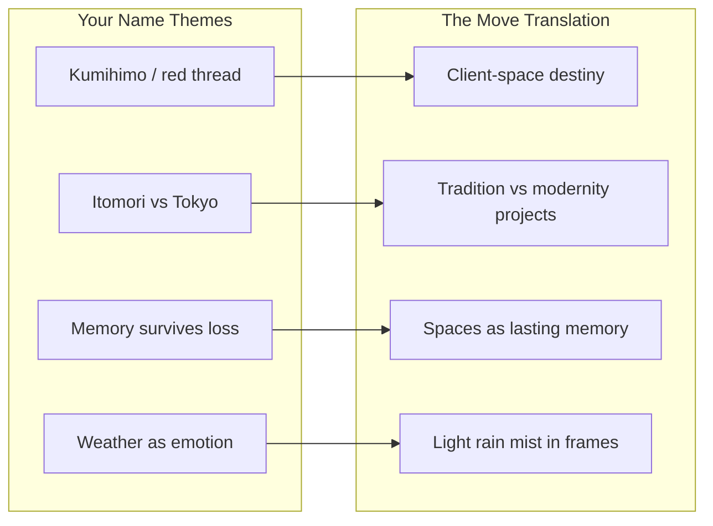
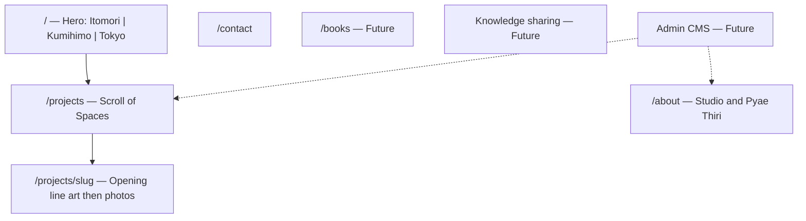
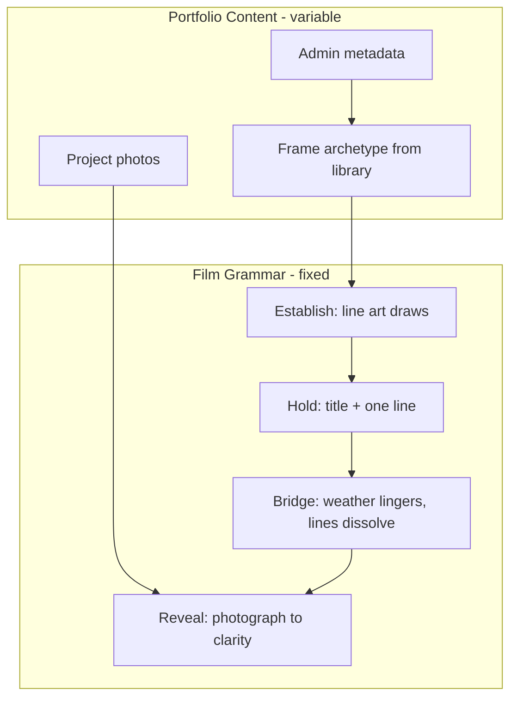

# The Move: Context, Business Value, and Shinkai Vision

This plan captures **shared understanding** for future development. It is grounded in [THE_MOVE_MASTER_CONTEXT.md](THE_MOVE_MASTER_CONTEXT.md), your *Your Name* analysis, and the current repo state.

---

## 1. What The Move Is (Business Reality)

**The Move** is a luxury interior design and interior architecture studio founded by **Pyae Thiri** (2017). It is not a generic portfolio site—it is a brand built on:

| Dimension | Reality |
|-----------|---------|
| **Geography** | Global practice: London (spa, fashion HQ, Cotswolds), Majorca, Brooklyn, Vancouver Island, and historic UK residences (Hyde Park, Holland Park, Mayfair, Brighton, etc.) |
| **Positioning** | Bespoke, eclectic, timeless—antiques, contemporary art, craftsmanship, modernist furniture, global influences |
| **Client relationship** | Close collaboration; no two projects alike; spaces reflect personality and lifestyle |
| **Spectrum of work** | Grade II listed restoration ↔ contemporary urban apartments ↔ hospitality and commercial |

Source: [public/data/about.json](public/data/about.json) and master context §1.

**Business value the website must convey:**

1. **Trust through craft** — Attention to detail, materiality, and how people *live* in spaces (not just pretty photos).
2. **Distinct identity** — Originality and warmth in a crowded luxury-interiors market.
3. **Bridge worlds** — Heritage preservation and contemporary innovation in one practice (this is the firm’s real differentiator—and the Shinkai metaphor’s business anchor).
4. **Emotional before informational** — Visitors should *feel* the studio’s sensibility before reading project specs (aligned with master context: *“Their minds forget, but their hearts remember.”*)

---

## 2. Why Shinkai—Not Decoration, But Strategy

The goal is not “anime on a website.” It is **cinematic interior storytelling**: meditative pacing, atmosphere before explanation, memory and connection as felt experience—like Shinkai’s establishing shots in *Your Name* and *Weathering with You*.



### Kumihimo and the red thread (your analysis → brand)

From your *Your Name* notes and master context §2:

- **Musubi** — tying thread, connecting people, time’s flow; strands twist, tangle, break, rejoin.
- **Mitsuha’s red cord** — tangible when memory fades; physical proof of bond across time.
- **Meditative braiding** — wooden bobbins, gentle rhythm; emotional resonance *before* plot clarity.

**For The Move:**

| Film symbol | Interior design meaning |
|-------------|-------------------------|
| Intertwining strands | How rooms, people, and daily life connect in a home |
| Tangle / break / rejoin | Renovation journey—disruption, then harmony |
| Red thread of fate | The “right” space for a client; invisible pull toward belonging |
| Cord when memory fades | **Built environment** as memory that outlasts a single moment or trend |

The hero [kumihimo-cord.tsx](src/shared/components/the-move/kumihimo-cord.tsx) already frames this philosophically (“heart-to-heart architectural work… needs to be felt”). Your spec adds **richer braid texture**, highlight/shadow strands, animated tassels, and a floating cord—still **hero-only** per decision log (cord does not persist site-wide).

### Itomori vs Tokyo (duality = project spectrum)

| Left: Itomori (Mitsuha) | Right: Tokyo (Taki) | The Move |
|---------------------------|---------------------|----------|
| Shrine, torii, irimoya roof, shoji, mountains | Skyscrapers, trains, Suga-style stairs, balconies | Traditional restoration, warmth, craft |
| Rural memory, ritual, slowness | Urban pace, architecture student Taki, glass and steel | Contemporary apartments, commercial, precision |

**The website’s split hero** ([itomori-village.tsx](src/shared/components/the-move/itomori-village.tsx), [tokyo-cityscape.tsx](src/shared/components/the-move/tokyo-cityscape.tsx)) is **atmospheric metaphor**, not a geographic filter. Both sides click through to `/projects` (master context §12)—tradition and modernity are one catalogue, one firm.

**Your addition:** hand-drawn SVG line art of **The Move’s own buildings** (rural-heritage vs urban-contemporary project types) alongside or within the Itomori/Tokyo vocabulary. This aligns with brand truth if stylized as **archetypes** (heritage home vs city apartment), not literal film locations. For **scalability**, project-specific hero facades conflict with the templated frame library (§7)—hero archetypes + templated project frames is the intended split.

### Memory, disaster, and hope (collective themes)

Your analysis Part 3—Itomori erased, Taki remembers, bodies know before minds—maps to:

- Spaces as **containers for life** that survive trend cycles.
- The studio’s role in **preserving** character (listed buildings) while **moving forward** (contemporary layers).
- UX: recognition without full explanation—visitor senses “this is for me” before reading copy.

### Weather and loneliness

*Weathering with You* and rain/sun toggles on the hero support **mood as design language**: rain-grey introspection, golden clarity, mist—assigned via admin metadata to frame library moods later (master context §7).

---

## 3. Experience Architecture: From Portfolio to “Film”

### Core shift (master context §3)

| Today (mostly built) | Target experience |
|----------------------|-------------------|
| Photo grid on `/projects` | **Scroll of Spaces** — vignettes, line art draws, title fades, photo reveals |
| Static project click | Scroll-driven storyboard pacing |
| Carousel (removed) | Emotional buildup on landing, no instant showcase |

### Page roles



**Landing** ([hero-section.tsx](src/shared/components/the-move/hero-section.tsx)): Shinkai palette, weather toggle, cord, dual worlds—**partially implemented**; missing draw-on-scroll SVG paths, wired nav/CTA to `/projects`, and resolution of duplicate nav ([Navbar.tsx](src/shared/components/Navbar.tsx) vs [header.tsx](src/shared/components/the-move/header.tsx)).

**Projects**: 16 entries in [project-list.json](public/data/project-list.json), only **3** detail JSON folders—most slugs 404. Still classic grid ([ProjectsSection](src/shared/components/projects/)), not Scroll of Spaces.

**Project detail**: Layout preserved (generous images, sidebar)—**opening facade line-art animation** not built yet.

**Navigation target**: THEMOVE | PROJECTS | ABOUT | CONTACT | BOOKS (nendo.jp minimalism). BOOKS and knowledge section are **future**.

---

## 4. Visual Language (2D Line Art)

Per master context §4 and your spec:

- **Thin, consistent SVG strokes** — craftsman hand, not cold 3D renders.
- **Draw animation** — `stroke-dasharray` / `stroke-dashoffset` + Intersection Observer (specified; hero currently uses opacity/motion more than path-draw).
- **Hero elements you enumerated:**
  - **Cord:** braid pattern, highlights/shadows, tassels, floating fate thread.
  - **Itomori left:** torii, irimoya house, shoji, engawa, mountains, pine/bamboo, stone path.
  - **Tokyo right:** glass towers, elevated tracks, lamps, power lines, shrine stairs, balconies.
- **Color:** twilight blue/purple, golden hour, rain grey, comet magenta accents only.
- **Typography:** THEMOVE wordmark; serif for narrative, sans for UI.

Existing site tokens in [globals.css](src/app/globals.css) (olive, beige, gold) coexist with the new hero’s slate/sky palette—**unification** is a future design task.

---

## 5. CMS and Admin Independence (Business Operations)

**Why it matters:** The Move scales projects globally; depending on developers for every upload blocks the business.

**Planned model** (master context §7, §10):

1. Admin uploads images + metadata: location, style, mood, season, title, description, about/contact content.
2. System assigns **atmospheric frame** from a library (Paris morning mist, London rain, traditional golden hour, etc.).
3. **No per-project custom illustration** — frames are templated; photos do the specificity.

**Current state:** Static JSON under [public/data/](public/data/) + Sanity CDN URLs in JSON; **no** Sanity SDK, admin UI, or auto frame assignment.

This is the bridge between **art direction** (Shinkai feel) and **operational reality** (dozens of projects, non-technical staff).

---

## 6. Future Phases (Roadmap Context)

| Phase | Scope |
|-------|--------|
| **Phase 1 (now)** | Hero polish, navbar, Scroll of Spaces, detail opening animation, frame library |
| **Later** | BOOKS showcase, knowledge sharing (journal/posts/videos), ambient sound, atmosphere markers between detail images, expanded weather in frames |

Books and knowledge sharing support **thought leadership**—aligning with Pyae Thiri’s creative direction practice and global luxury positioning, separate from the project catalogue narrative.

---

## 7. Current Codebase vs Vision (Gap Map)

| Area | Status |
|------|--------|
| Master context doc | Complete single source of truth |
| Shinkai hero components | Built (SVG + Framer Motion + weather) |
| Kumihimo philosophy in code | Documented in component comments |
| Scroll of Spaces | Not started |
| Frame library + CMS | Not started |
| Project content completeness | 3/16 detail pages |
| Legacy grid + new hero | **Transitional** repo |
| Metadata copy | [layout.tsx](src/app/layout.tsx) mentions Myanmar; about.json describes UK/global firm—**reconcile** when editing |

---

## 8. Principles for Every Future Session

When development resumes, align to:

1. Read [THE_MOVE_MASTER_CONTEXT.md](THE_MOVE_MASTER_CONTEXT.md) first.
2. **Feel before facts** — pacing, atmosphere, restraint (Shinkai establishing shots, kumihimo braiding rhythm).
3. **Duality is one brand** — tradition and modernity connected by cord, not split into separate sites.
4. **Scalable poetry** — templated frames + admin metadata, not bespoke anime art per project.
5. **Preserve what works** — project detail photo layout stays; animation is opening moment only.
6. **Respect decision log** — no landing carousel; cord hero-only; both hero sides → `/projects`.

---

## 9. Open Alignment (For You to Confirm Later)

These are not blockers for understanding, but worth deciding before build:

1. **Hero buildings:** Pure Itomori/Tokyo symbolism vs stylized **Move project archetypes** (e.g. Mayfair pied-à-terre vs Cotswolds estate) in the hero SVGs.
2. **Frame transition** (master context §13): border remains vs frame dissolves vs weather-only remains when photo appears.
3. **Brand geography in SEO/metadata:** Myanmar vs UK/global (copy inconsistency today).

---

## 10. One-Sentence North Star

**The Move connects tradition and modernity in physical space the way kumihimo connects strands across time—the website should make visitors feel that bond before they read a single project brief, through hand-drawn light, weather, and scroll-paced memory—not a thumbnail grid.**

---

## 11. Showcase Book Analysis (Real Portfolio vs Dummy Data)

**Source:** `The Move-Project Showcase Book 2023-2025.pdf` (78 pages, InDesign export; 71 pages with extractable text).  
**Confirmed:** [public/data/](public/data/) — especially [project-list.json](public/data/project-list.json) — is **placeholder** (16 UK/Europe/SF luxury titles from legacy Sanity). The PDF is the **operational catalogue** for 2023–2025.

### What the book actually is

| Attribute | Showcase Book reality |
|-----------|----------------------|
| **Firm snapshot (p.3)** | THE MOVE founded 2023; Pyae Thiri (interior) + Kaung Khant (RA, MAC); Mandalay-based team scaling to architects + interior designers |
| **Geography** | Myanmar: Mandalay, Yangon, Pyin Oo Lwin, Monywa, Shwe Taung Gyar |
| **Project count** | **32 named projects** in this edition |
| **Split** | ~10 residential, ~22 commercial / F&B / hospitality / education / retail |
| **Services** | Interior Design, Architecture, Interior + Landscape, mixed |

### Full project inventory (for CMS + frame assignment later)

**Residential:** KT, MAAK, SSL, KLG, MPP, UWL, Bungalow (UVS), TM, 239, TWA, HMM residences.

**Commercial / retail / office:** Better U Hair & Wellness, ATLAS Outlet, Beauty Empire Cosmetic Shop, Moe Kaung Gold Shop, LMT Office, Mini Mart, Mandalay Mahar Akarit, Royal Auto Service, Shwe BonThar Gold & Jewellery, Shwe Yamin Fancy & Bag.

**F&B / hospitality / education:** Universe 51 Japanese Restaurant, Yadanar Moe Cafe, Coffee Burma Restaurant, She Cafe, Bokki, UVS Canteen, Buzz Kaffee, Ingyin Myaing Academy, Coffee Education Center, Hotel Wonderland, Apollo Bar & KTV.

### Design-language patterns (from narratives — drives mood metadata)

| Pattern | Examples in book | Anime / frame implication |
|---------|------------------|---------------------------|
| **Modern warm minimalism** | KT, SSL, many condos | Soft morning light, clean geometry, few strokes |
| **Heritage / classical care** | KLG (“Architecture of Care”, mango trees, porch) | Heritage frame, golden hour, organic rooflines |
| **Cultural reverence + modern luxury** | MAAK | Traditional-golden + subtle shrine vocabulary |
| **Urban condo calm** | SSL Yangon, TM narrow footprint | Contemporary-blue, vertical strokes, rain-mist |
| **Sanctuary / subtraction** | UWL (“art of taking away”, rooftop, pool) | Winter-still or paris-morning, expansive negative space |
| **Spa / biophilic / jacuzzi** | Bungalow, Better U | Mist, particles, curved interior thresholds |
| **Retail / gold / display** | Gold shops, ATLAS, Beauty Empire | Sharper geometry, warmer accent strokes (not garish) |
| **Japanese reference** | Universe 51 | Urban frame with restrained Japan cues — not cosplay |

### Primary catalogue (decided)

**Source of truth:** `The Move-Project Showcase Book 2023-2025.pdf` — **32 Myanmar projects** (2023–2025).  
**Placeholder:** Everything under [public/data/](public/data/) is dummy (legacy UK/Europe titles) and will be **replaced** on PDF ingest.  
**About copy:** [about.json](public/data/about.json) still describes UK/global work — update when ingesting real catalogue (owner decision May 26, 2026).

---

## 12. The Core Challenge: “Japanese Cartoon Viewing” × Variable Projects

### What the client loves (nendo) vs what you must deliver (Shinkai)

| Reference | What to borrow | What NOT to copy |
|-----------|----------------|------------------|
| [nendo.jp](https://www.nendo.jp/en/) — [space works](https://www.nendo.jp/en/genre/space/) | **Clarity:** thin, confident 2D line art; calm layout; work speaks through restraint | Nendo’s catalogue is essentially **static clarity** — no scroll-film pacing |
| Shinkai (*Your Name*, *Weathering with You*) | **Pacing:** establishing shots, weather as emotion, memory before explanation, meditative holds | Literal film scenes, character animation, per-location bespoke backgrounds |

**North star (unchanged):** Users feel they are **inside an animated establishing sequence**, not clicking a Behance grid.

### Why this feels “difficult”

1. **Film is fixed length; portfolio is open-ended** — projects will be added, reordered, archived.
2. **Film is one story; portfolio is many stories** — 32+ unrelated clients unless you **compose** a meta-narrative.
3. **Bespoke anime art per project does not scale** — already decided (templated frames only).
4. **Photos are the truth; line art is the threshold** — animation must **release** into photography (Option 3 / Option 2), not compete.
5. **Mixed typologies** — a Yangon condo, a gold shop, and a Japanese restaurant do not share one facade silhouette; **mood** must carry continuity, not identical drawings.

### Reframe (solution anchor)

> **You are not building “anime for each project.” You are building “film grammar for every project slot.”**

The “Japanese cartoon viewing experience” lives in **time, sequence, and atmosphere** — draw → hold → weather → reveal — implemented once in [SpaceVignette](src/shared/components/projects/SpaceVignette.tsx) and [frame-transitions.ts](src/shared/lib/frame-transitions.ts), not in 32 unique illustrations.



---

## 13. Solution Design Ideas (Brainstorm + Justification)

Each option is **compatible** with templated frames and admin uploads. **Owner-confirmed stack: A + C + D + E + B** (see §17, §19).

### Idea A — “Establishing Shot” vignette (current direction, sharpened)

**What:** Every project occupies one **viewport-height beat** (~90vh). Scroll triggers one complete cycle: draw (2s) → dissolve lines (0.7s) → weather linger (0.9s) → photo reveal (0.9s). No second animation until next vignette.

**Why it feels like anime:** Matches Shinkai’s **pause before meaning** — viewer sits in atmosphere, then reality (photo) arrives.

**Scales because:** Adding project #33 adds **one more beat**, not new code paths.

**Risk:** Long catalogue = long scroll fatigue. **Mitigation:** Idea C (chapters) or collapsed “reel index.”

**Status:** Partially built — [ScrollOfSpaces](src/shared/components/projects/ScrollOfSpaces.tsx), [assign-frame-mood](src/shared/lib/assign-frame-mood.ts), Heritage/Urban/Atmospheric frames.

---

### Idea B — Kumihimo “strand” through the scroll (meta-narrative)

**What:** A **single hairline cord** (hero vocabulary, simplified) runs vertically beside the vignette column — subtly advancing scroll position, occasionally **tangling** (opacity pulse) at chapter boundaries, **rejoining** after commercial sections.

**Why:** Implements *musubi* literally: many projects, one practice. Connects landing hero (cord) to catalogue without persisting full hero art site-wide.

**Scales because:** Cord is one SVG layer; project count only changes scroll length.

**Risk:** Visual noise if too prominent. **Mitigation:** 1px stroke, 15–20% opacity, disabled on `prefers-reduced-motion`.

**Justification:** Solves “how does it feel like one film?” without custom art per project.

---

### Idea C — Chapters (anime episode cards)

**What:** Group projects in CMS:

| Chapter | PDF alignment | Interstitial |
|---------|---------------|--------------|
| **Residential** | KT → HMM | Line-art title card: “Spaces to live” |
| **Commercial** | Retail, offices, gold shops | “Spaces to gather & work” |
| **Hospitality & F&B** | Cafes, hotel, bars | “Spaces to serve” |

Between chapters: **3–4s interstitial** — minimal kanji-adjacent typography optional, frame draws a **torii OR storefront OR cup** icon (three templated interstitials only).

**Why it feels like anime:** Episode/chapter structure turns an endless list into **acts**.

**Scales because:** New cafe project → assign to Hospitality chapter → catalogue grows inside an act.

**Risk:** Owner must categorize on upload. **Mitigation:** Default category from project type field; override in admin.

---

### Idea D — Frame archetype library (extend beyond Heritage / Urban)

**What:** Map metadata → **6–8 archetypes** (not 32 drawings):

| Archetype | When (Showcase Book) | Line vocabulary |
|-----------|----------------------|-----------------|
| **Heritage** | KLG classical, MAAK cultural | Torii, irimoya, organic roof (existing) |
| **Urban** | SSL, TM, Yangon condos | Towers, tracks, balconies (existing) |
| **Threshold** | Shops, gold retail | Doorframe, awning, display window |
| **Interior chamber** | UWL, KT warm minimal | Room box, window light rectangle |
| **Garden / biophilic** | KLG porch, Bungalow spa | Trees, horizon, water line |
| **Hospitality glow** | Cafes, Hotel Wonderland | Steam curves, pendant lights (abstract) |

**Nendo alignment:** Each archetype stays **sparse, hand-drawn, consistent stroke** — like nendo’s product sketches, not busy backgrounds.

**Scales because:** Admin picks type OR auto-rules from keywords (`restaurant`, `gold`, `hotel`).

**Justification:** Fixes “gold shop and condo look wrong in same torii frame” without bespoke illustration.

---

### Idea E — Photo reveal as “reality entering the frame” (Option 3 — decided)

**What:** Architectural strokes **dissolve**; **weather particles linger** ([FrameWeatherParticles](src/shared/components/frames/FrameWeatherParticles.tsx)); photo reaches **full clarity**; weather fades.

**Why Shinkai:** The “supernatural” layer (line + weather) yields to the **real world** (photography) — same as memory yielding to present in *Your Name*.

**Why nendo:** Final state is **clean image**, no decorative chrome — nendo-like honesty.

**Detail pages:** Full dissolve once ([ProjectOpeningReveal](src/shared/components/project/ProjectOpeningReveal.tsx) — Option 2); rest static.

---

### Idea F — Pacing curve (director’s timeline)

**What:** Not every vignette uses identical timing. **Scroll velocity** or **section position** adjusts holds slightly:

| Position | Hold bias | Emotional intent |
|----------|-----------|------------------|
| First 2 projects after hero | +20% draw/linger | “Opening credits” |
| Middle bulk | Standard timings | Rhythm |
| Last project before footer | +10% linger | “Closing shot” |

**Scales because:** Rules are index-based, not project-specific.

**Risk:** Feels arbitrary if noticeable. **Mitigation:** ±15% max; respect reduced motion.

---

### Idea G — “Film strip” index (optional escape hatch)

**What:** Fixed corner or footer: **thin progress bar** styled as film perforations or chapter dots — shows “where you are in the reel” without turning into a grid.

**Why:** Viewers tolerate long scroll when they sense **duration and structure** (like chapter markers in a film).

**Scales:** Dot count = project count; chapters = grouped dots.

**Not a grid:** No thumbnails until user deliberately opens “overview” mode (future).

---

### Idea H — Sound & ambient (Phase 2 — note only)

Rain loop, faint city hum, or kumihimo braid ASMR on hero only. **Deferred** per master context — but design **leave headroom** (mute toggle, no autoplay on mobile without gesture).

---

## 14. Recommended Combined Direction — **CONFIRMED**

**Locked stack:** **A + C + D + E + B** (establishing vignettes, chapters, frame archetypes, photo reveal grammar, subtle scroll cord). Idea G (film-strip progress) remains optional for a later pass.

```mermaid
flowchart TB
  Hero[Landing: Itomori | Cord | Tokyo]
  Ch1[Chapter card: Residential]
  V1[Vignette: archetype draw → weather → photo]
  V2[More residential vignettes...]
  Ch2[Chapter card: Commercial]
  Vn[Commercial vignettes with Threshold archetype...]
  Hero --> Ch1 --> V1 --> V2 --> Ch2 --> Vn
```

| Decision | Status | Value |
|----------|--------|-------|
| Primary catalogue | **Confirmed** | Showcase Book — 32 Myanmar projects; replace `public/data/` dummy |
| Viewing stack | **Confirmed** | A + C + D + E + B |
| Scroll length | **Confirmed** | Full-viewport beat per project (~32+ beats OK) |
| Cord in scroll | **Confirmed** | Yes — subtle vertical kumihimo strand |
| Chapter cards | **Confirmed** | English only |
| Chapters | **Confirmed** | Residential → Commercial → Hospitality & F&B |
| Unique anime per project? | **No** | Templated archetypes + metadata only |
| Hero vs catalogue | **Confirmed** | Hero = Shinkai metaphor; catalogue = 6–8 archetypes |

---

## 15. Content Model Sketch (for CMS — when build resumes)

Minimum fields per project (from Showcase Book + frame system):

```yaml
title: "KLG Residence"
slug: "klg-residence"
category: residential | commercial | hospitality
location_city: "Mandalay"
location_country: "Myanmar"
project_type: interior | architecture | both
mood_tags: [warm-minimal, classical, accessible, biophilic]  # multi-select
season: summer | winter | null
hero_image: ...
gallery: [...]
one_line: "A classical home designed as Architecture of Care."
frame_archetype: auto  # or override: heritage | urban | threshold | ...
```

`assign-frame-mood` evolves to `assign-frame-archetype` using **category + mood_tags**, not London/Paris keywords alone.

---

## 16. What to Avoid (anti-patterns)

| Anti-pattern | Why it breaks the vision |
|--------------|--------------------------|
| Grid-first `/projects` | Instant browse = opposite of establishing-shot pacing |
| Looping character animation | Reads as gimmick, not architecture |
| Per-project SVG facades | Showcase Book scale forbids |
| Heavy parallax on photos | Fights nendo clarity; motion belongs in line layer |
| Same torii frame on a gold shop | Breaks trust — use Threshold archetype |
| Animation between detail gallery images | Already rejected — preserves photo viewing |

---

## 17. Resolved Decisions (Owner — May 26, 2026)

| # | Question | Decision |
|---|----------|----------|
| 1 | Primary catalogue | **Showcase Book (32 Myanmar)** — `public/data/` is dummy until PDF ingest |
| 2 | Viewing stack | **A + C + D + E + B** (see §13) |
| 3 | Scroll length | **Full-viewport beats** for every project — no shortened “featured reel” |
| 4 | Cord in scroll | **Yes** — subtle kumihimo strand beside vignette column |
| 5 | Chapter cards | **English only** |

**Chapter order (locked):**

1. **Residential** — KT through HMM residences (11 projects)  
2. **Commercial** — retail, offices, wellness, auto, gold shops (11 projects)  
3. **Hospitality & F&B** — cafes, restaurants, hotel, bar/KTV, academies (10 projects)

---

## 18. One-Sentence Viewing-Experience North Star

**Each project is one Shinkai establishing shot expressed through nendo-clear line art: the frame draws, the weather holds the feeling, the photograph arrives as truth — and chapters turn a growing portfolio into a film you scroll, not a wall of thumbnails.**

---

## 19. Locked Build Spec (Scroll of Spaces — when development resumes)

Use this checklist against [THE_MOVE_MASTER_CONTEXT.md](THE_MOVE_MASTER_CONTEXT.md) §7:

| Layer | Requirement |
|-------|-------------|
| **A — Vignette** | One ~`92vh` beat per project; Option 3 transition (draw → dissolve lines → weather linger → photo clarity) |
| **C — Chapters** | English interstitial before each group; three templates (residential / commercial / hospitality) |
| **D — Archetypes** | Extend beyond Heritage + Urban: Threshold, Interior chamber, Garden/biophilic, Hospitality glow |
| **E — Reveal** | Photo always wins; no competing animation on detail gallery |
| **B — Cord** | ~1px hairline, low opacity, tracks scroll; pulse/tangle at chapter boundaries; off when `prefers-reduced-motion` |
| **Data** | Ingest 32 projects from Showcase Book; slugs + `category` + Myanmar locations + `frame_archetype` auto-rules |
| **Pacing** | Full scroll — ~32+ beats acceptable; optional Idea G (film dots) deferred |
| **Detail meta poem** | Project detail page shows metadata (city/country/type/area/tags/mood tags) in a restrained **vertical poem** sidebar inspired by arbol’s stacked copy rhythm ([arbol reference](https://www.arbol-design.com/newtop)) |
| **Description + Philosophy poems** | `DESCRIPTION` and `PHILOSOPHY` sections use vertical poem line-break templates tuned by `projectType` + `category` (no data changes) |

**Not in Phase 1:** Sound (Idea H), bilingual chapter copy, UK dummy projects as catalogue.
